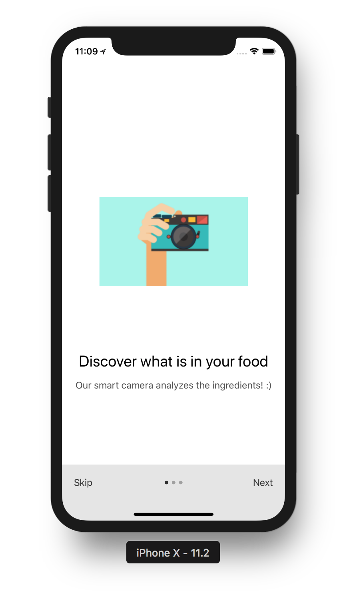
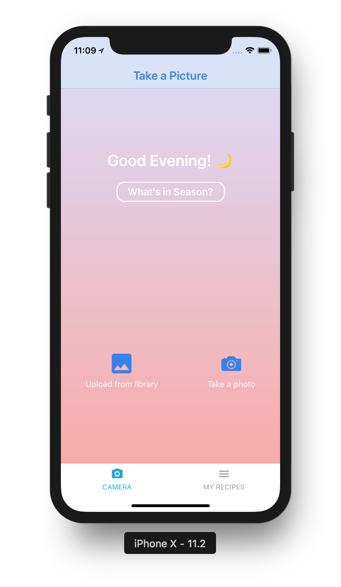
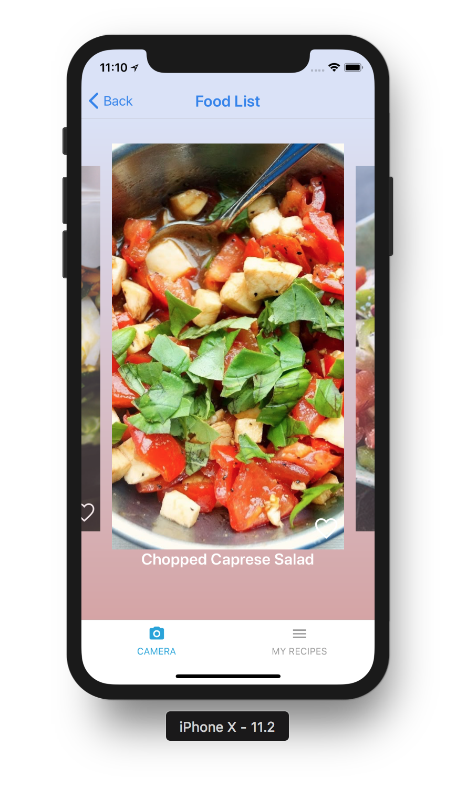
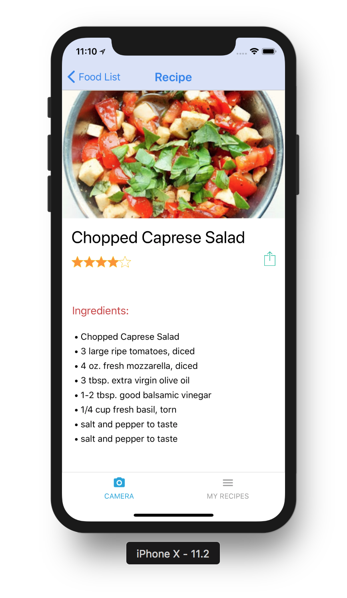
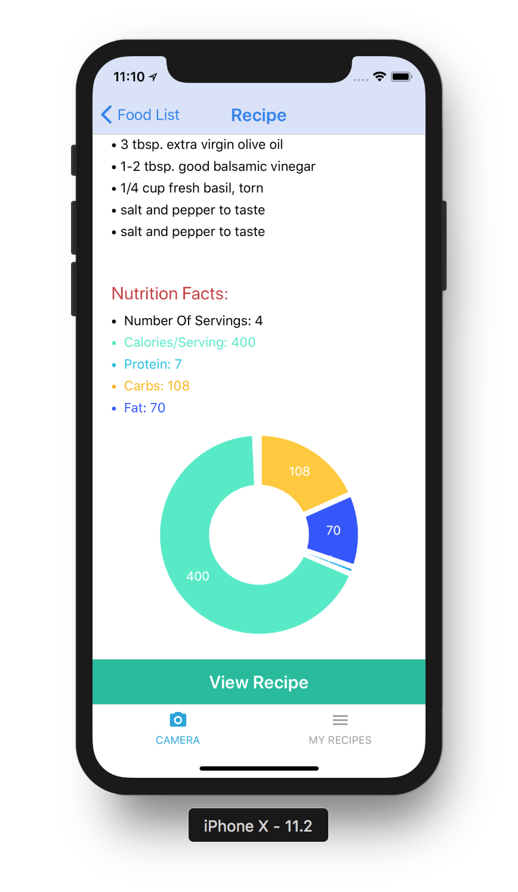
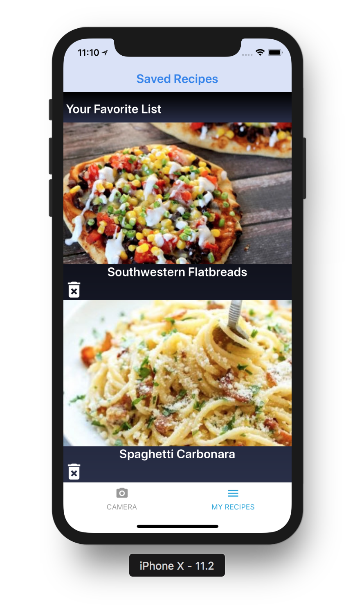
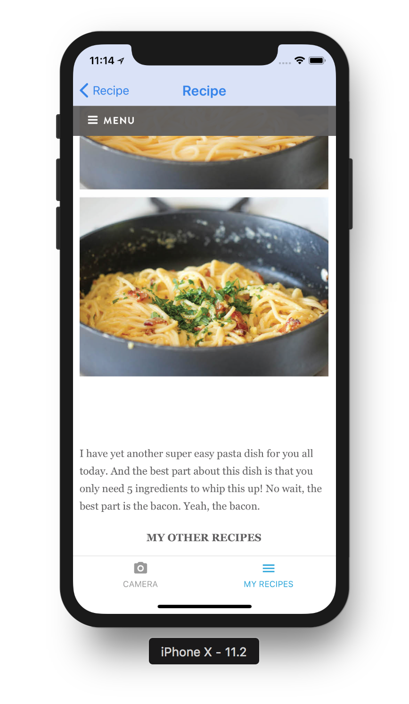
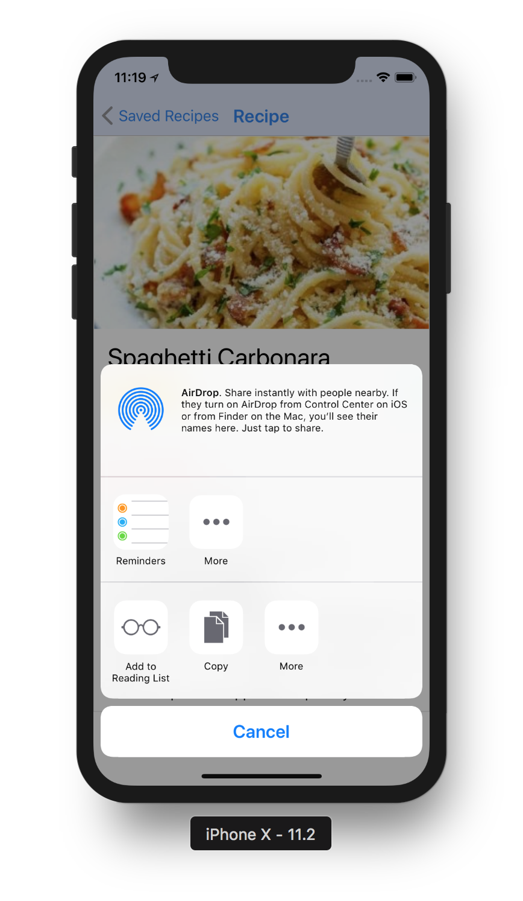

# csc413-SecondGame Team 20

## Team members:
  - Jakhongir Khusanov 
  - Teodora Caneva

<h3 align="center">
  HealthyEats mobile app
</h3>

  HealthyEats is a tool to get food recipes based on food photo

#### Environment:
React Native, with JavaScript, Visual Studio Code + Expo XDE 
Additional library (package manager): npm

### [Demo - Try it on Expo](https://exp.host/@jkhusanov/healthy-eats)
How to run the Demo on your phone:
1. Install **Expo** Client Application on your device: [iOS here](https://itunes.apple.com/app/apple-store/id982107779) and [Android here](https://play.google.com/store/apps/details?id=host.exp.exponent&referrer=www)
2. Navigate to https://expo.io/@jkhusanov/healthy-eats on a computer 
3. Scan QR code on the right hand side via camera
Note: If being tested on iPhone/iOS Expo will require log in/sign up, temporary login will be provided on the project documentation file.
4. Please Note: If any trouble testing the app, please contact either team member via slack (@teodora)(@jahon) or email us.

### Additional info
Please checkout this [Chowin-Out repo](https://github.com/mobile-space/chowin-out) which is a standalone app and has some improved features of this app. 

### Demo and some screenshots

  
  
  

  
  
  

  
  
  

## TODO
  - [x] Create the project and push it to the remote repository
  - [x] Implement navigation and initial screens
  - [x] Implement **IntroScreen** Slider UI 
  - [x] Implement main **TakePicture** screen UI 
    - [x] Use [Clarifai](https://clarifai.com/blog/what-food-is-this-clarifais-food-recognition-technology-can-tell-you) food recognition model and implement full dynamic functionality
  - [x] Implement **FoodList** screen UI with snap-carousel
    - [x] Use [Yummly Recipe API](https://developer.yummly.com/documentation) to get food recipe based on ingredients, and we will try to show relevant food based on ingredients.
  - [x] Implement **FoodRecipe** screen using Yummly API
  - [x] Implement **SavedRecipes** screen
    - [x] Use Yummly API
    to get dynamic data for recipes
  - [x] :star: **Bonus:** Share feature
  - [x] :star: **Bonus:** Search bar if food is not found based on ingredients
  - [x] Seasonal button
  - [x] Greetings based on time

#### Todo (initial): 
  - [x] Change Name of repo
  - [x] add Members to repo.
  - [x] List team members in this README.MD file
